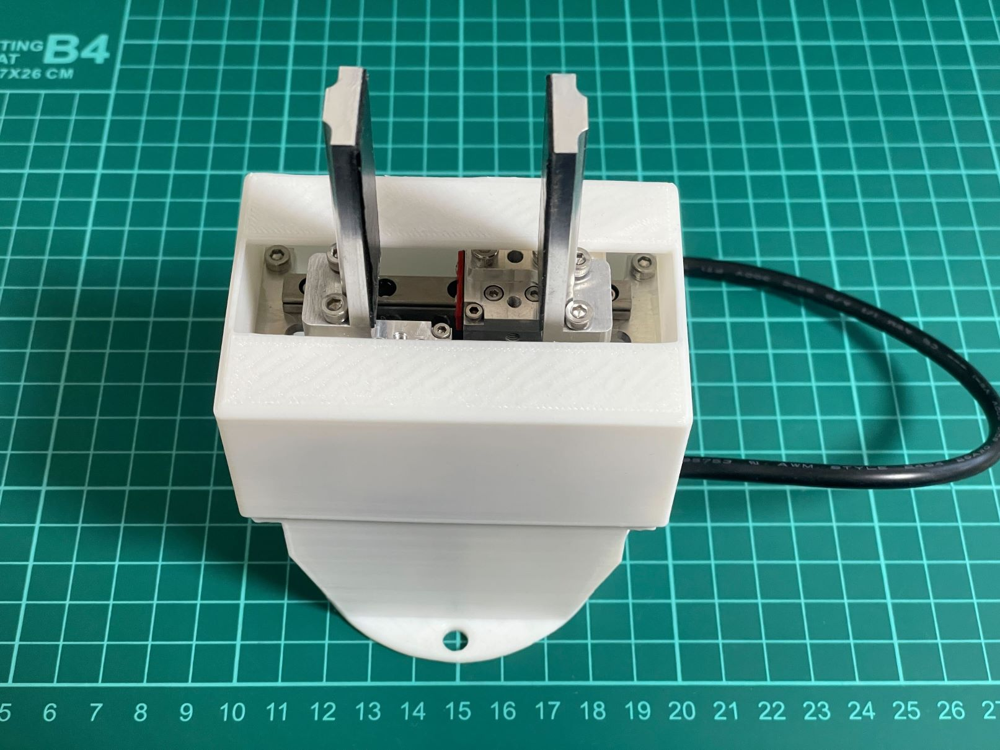
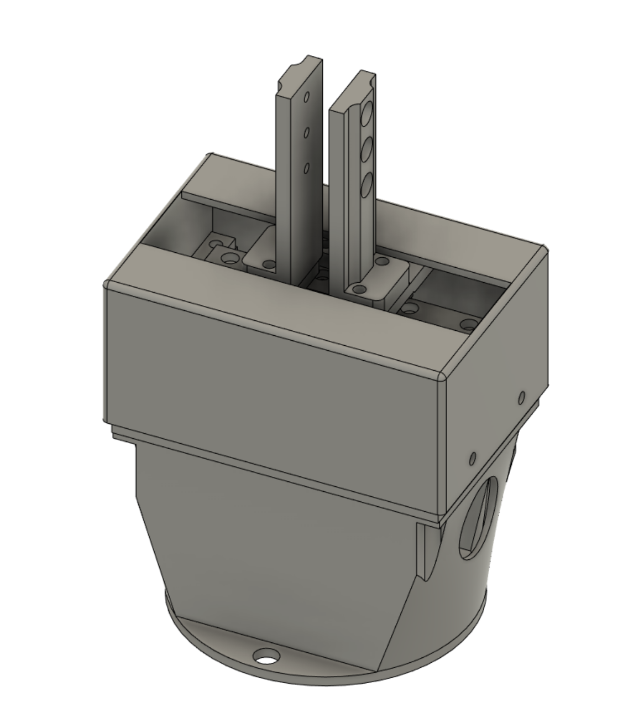
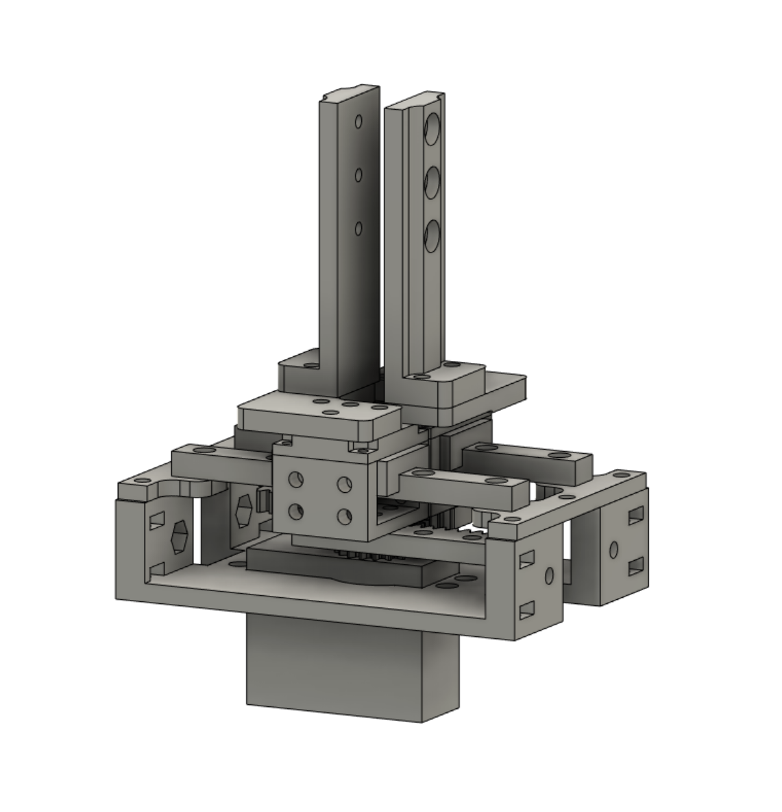
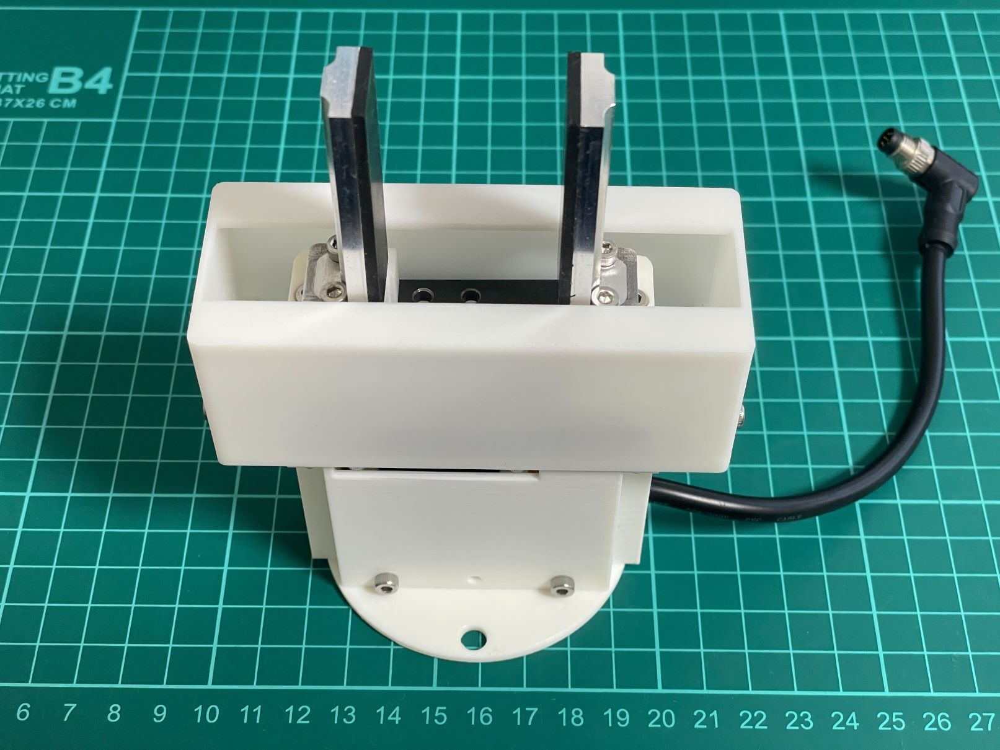
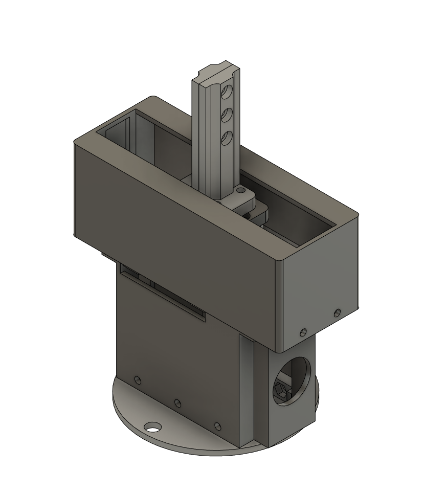
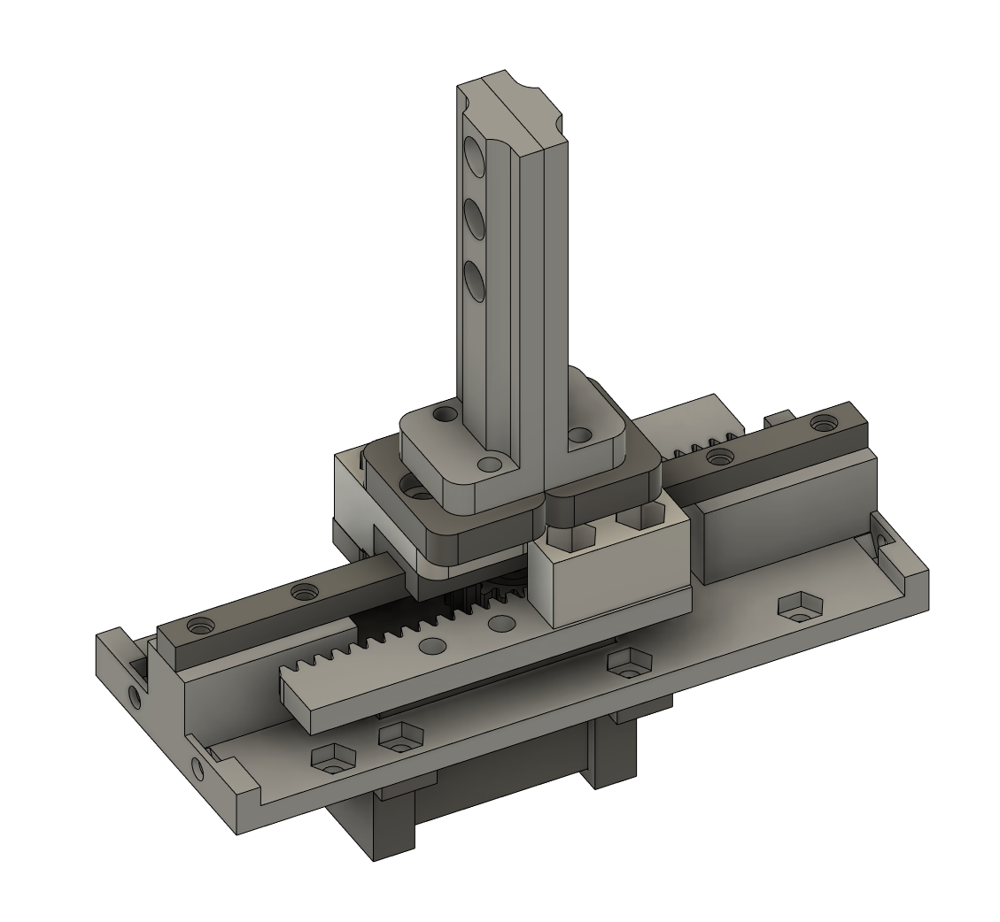

# Electric Parallel Gripper for UFACTORY LITE 6

## Introduction
This project provides electric parallel gripper for UFACTORY LITE 6.
This gripper can also be used for UFACTORY xArm series and possibly with other industrial cobots like Universal Robot etc.

Video (pick and place example with UFACTORY LITE 6 and OPEN Parallel Gripper): https://www.youtube.com/shorts/wrYzYbHsh44

There are two version available. SCS3045M_version which is original version I made and XL330_version which I redesigned to make the gripper lighter, thinner and cheaper at the expense of rigidity.
## SCS3045M_version
Detail: [SCS3045M_version](./SCS3045M_version/README.md)

  
- Use Feetech SCS3045M servo
- stroke: 0-55mm
- weight: about 340g
- Communication protocol: Two digital inputs(compatible with default LITE 6 gripper) or Modbus-RTU with RS485.

## XL330_version
Detail: [XL330_version](./XL330_version/README.md)

  
- Use Dynamixel XL330-M288-T servo
- stroke: 0-65mm
- weight: about 270g
- Communication protocol: Two digital inputs(compatible with default LITE 6 gripper) or Modbus-RTU with RS485.

## Contact
https://twitter.com/EL2031watson
