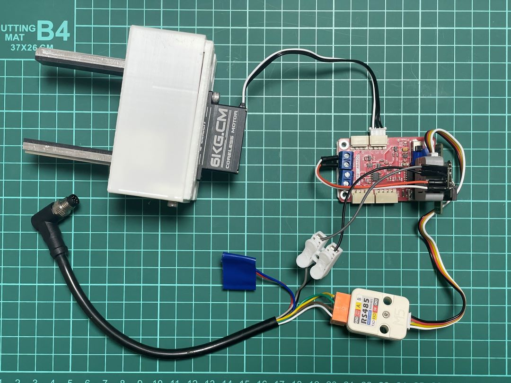
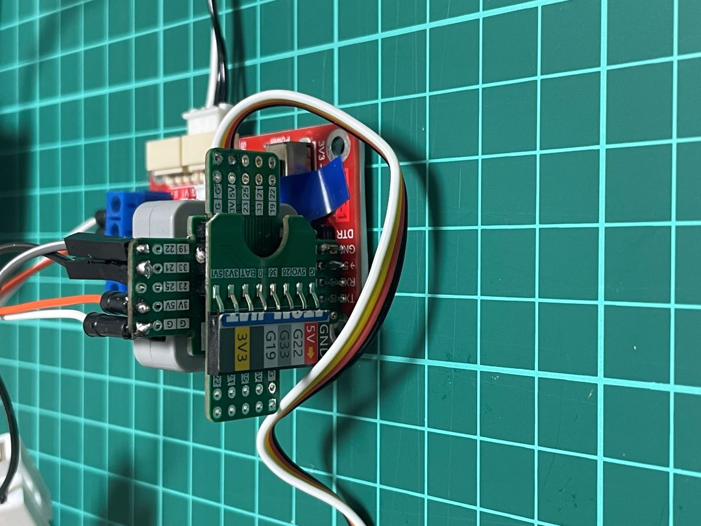
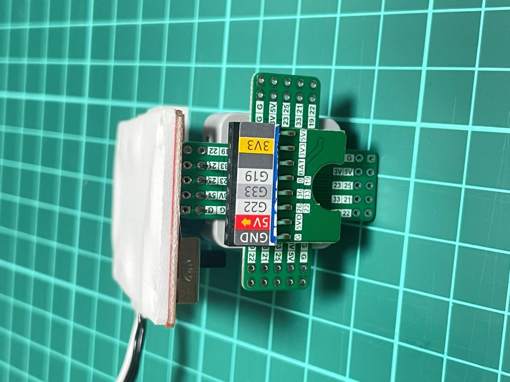
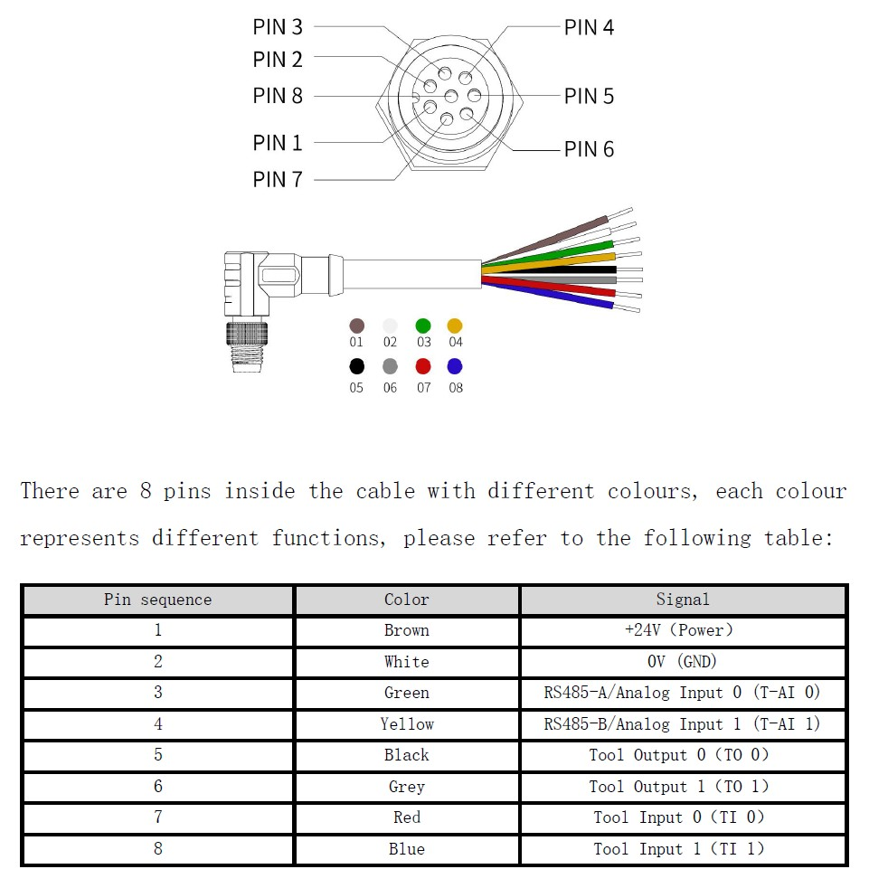
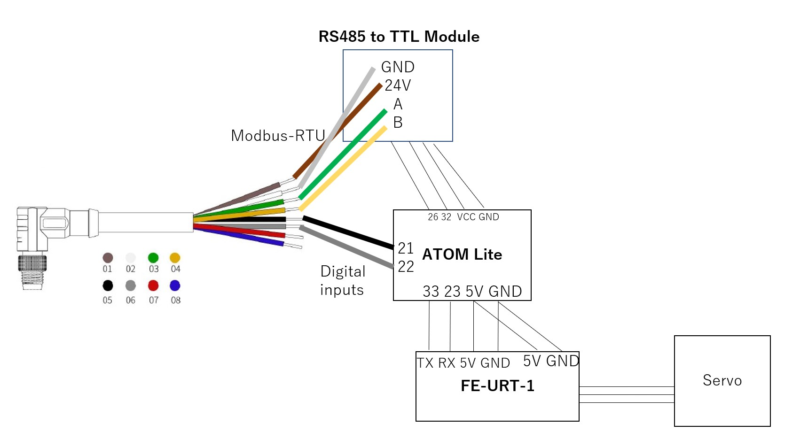

# OpenParalleGripper Electronics

## Summary
Electronics are under development. The connection might be unstable. Soldering may need.

## Wiring

(https://www.ufactory.cc/_files/ugd/896670_f65d7d89fab64945b885876178bbafa7.pdf)

Connect cable, RS485 module, ATOM Lite, Debug board and servo motor as follow:

