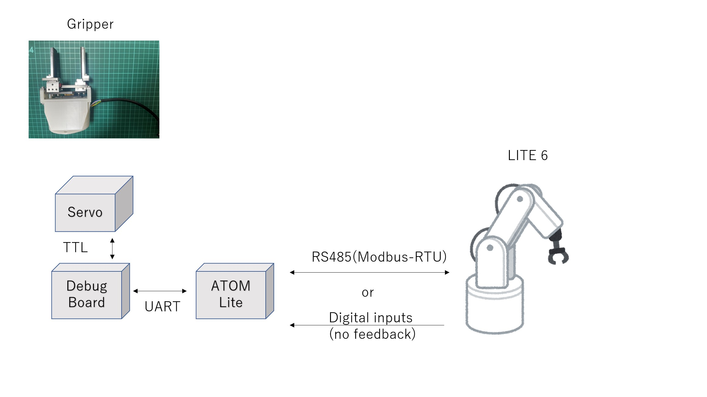

# OpenParallelGripper Software
## Software part is under development so you may need some effort to work this gripper.

## Summary
To control the gripper, you need to use either digital inputs from tool IO of LITE 6 or Modbus-RTU through RS485 of tool IO of LITE 6.



## Requirement

### Arduino IDE
- Feetech Servo Library (https://akizukidenshi.com/download/ds/feetech/SCServo.zip)
- Modbus-RTU Library (https://github.com/emelianov/modbus-esp8266)
- M5Atom Library (https://github.com/m5stack/M5Atom)

### PythonSDK
- xArm-Python-SDK(https://github.com/xArm-Developer/xArm-Python-SDK)

## Installation
Connect your ATOM Lite to PC and write the sketch software/gripper_driver/ModbusRTU_SCSServo.ino into your ATOM Lite.

Then run either of python script to open and close your gripper.

```
# for Modbus-RTU control
$ python3 control_with_modbus_rtu.py <IP address of arm> oc

# for digital input control
$ python3 control_with_lite6_api.py <IP address of arm> oc
```

The 2nd argument is list of action. "o" means open and "c" means close.
```
# Just open the gripper
$ python3 control_with_lite6_api.py <IP address of arm> o

# Just close the gripper
$ python3 control_with_lite6_api.py <IP address of arm> c

# open and close the gripper 4th times
$ python3 control_with_lite6_api.py <IP address of arm> ococococ
```