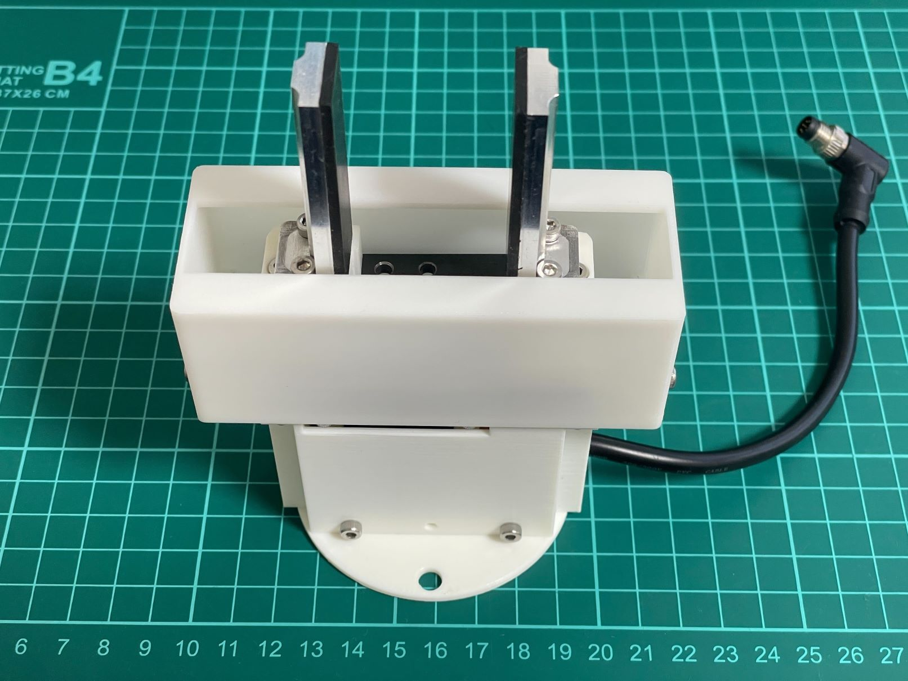
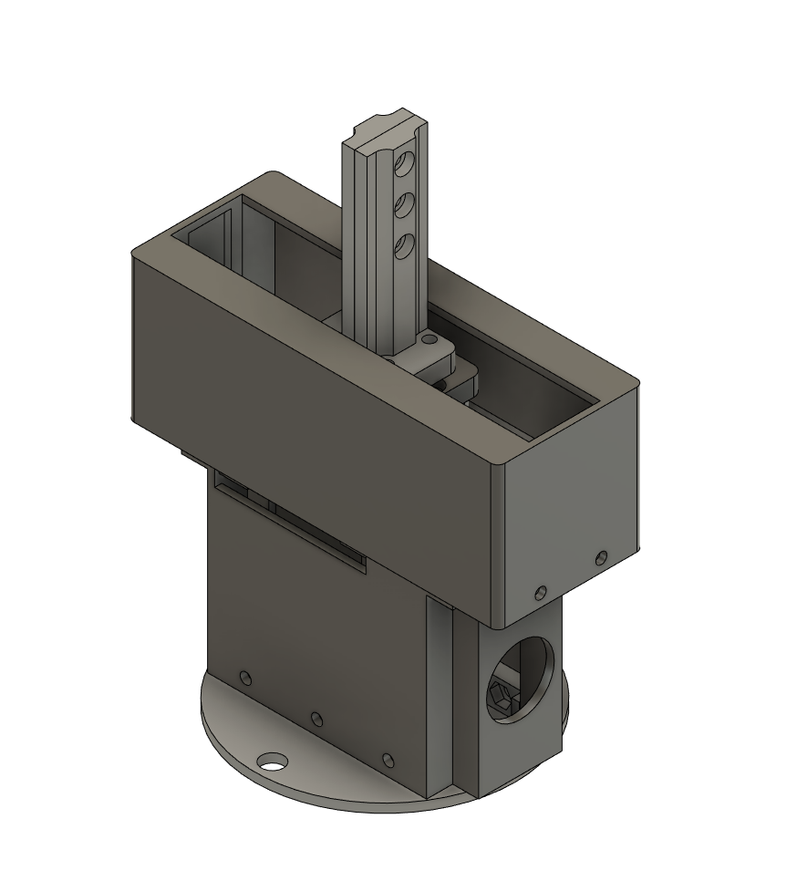

# Electric Parallel Gripper for UFACTORY LITE 6(XL330 version)

## Introduction
This project provides electric parallel gripper for UFACTORY LITE 6.
This gripper can also be used for UFACTORY xArm series and possibly with other industrial cobots like Universal Robot etc.

 

 

Video (pick and place example with UFACTORY LITE 6 and OPEN Parallel Gripper): https://youtube.com/shorts/0Ie3bUuqNkI?si=m0Drl9e4QJItGcFO

## Spec of the gripper
- stroke: 0-65mm
- weight: about 270g
- Communication protocol: Two digital inputs(compatible with default LITE 6 gripper) or Modbus-RTU with RS485.

## BOM
Check [BOM](./hardware/BOM.md)

## Assemble instruction
Not yet avaialble.

## Electronics
See [Electronics](./electronics/README.md)
## Software
See [Software](./software/README.md)

If you prefer to use two digital inputs to control the gripper for simplicity, you can use xArm SDK from UFACTORY(https://github.com/xArm-Developer/xArm-Python-SDK/blob/master/xarm/wrapper/xarm_api.py#L3654).

If you want to control the gripper more detail, you need to use Modbus-RTU with RS485.

## Contact
https://twitter.com/EL2031watson
