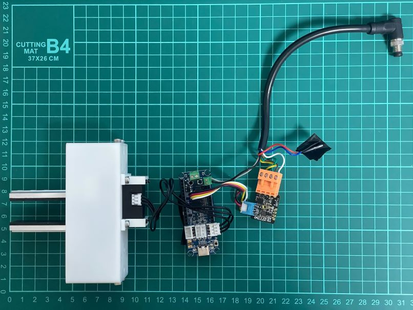
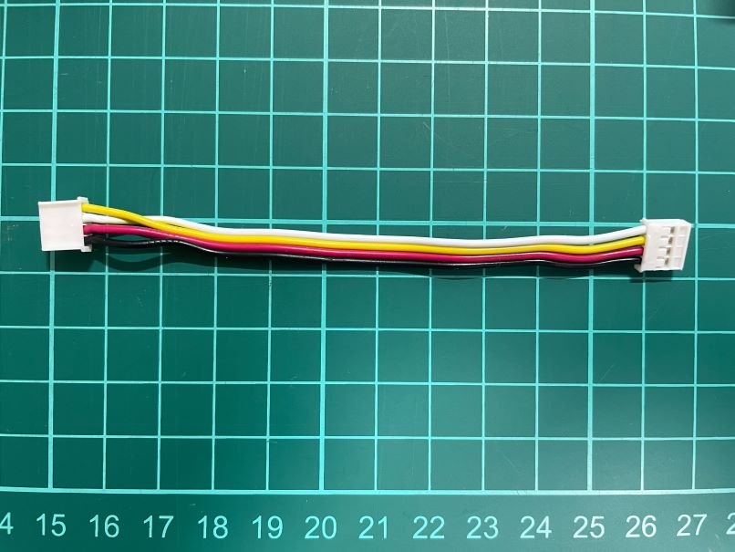
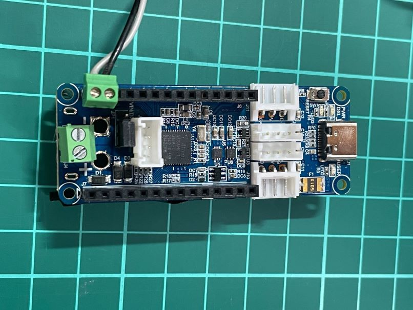
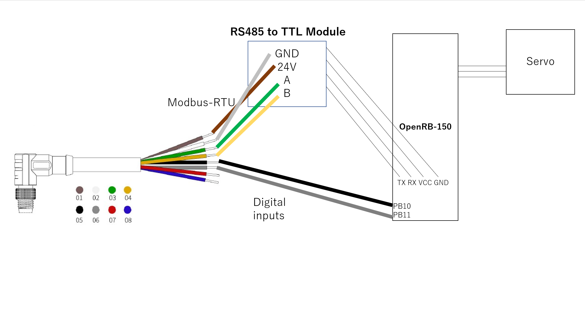

# OpenParalleGripper Electronics(XL330_version)

## Summary
Electronics are under development. The connection might be unstable. Soldering is required.

Need to make cross Grove cable to use Grove pin header since the alignment of TX and RX of OpenRB-150 is different from RS485 (switch white and yellow wires of Grove cable)

Need to add grove pin header and 2.54mm pitch terminal block
- Solder grove 4-pin header onto OpenRB-150 J12
- (Optinal) Put 2.54mm pitch terminal block onto PB10 and PB11 of OpenRB-150

## Wiring

(https://www.ufactory.cc/_files/ugd/896670_f65d7d89fab64945b885876178bbafa7.pdf)

Connect cable, RS485 module, ATOM Lite, Debug board and servo motor as follow:

