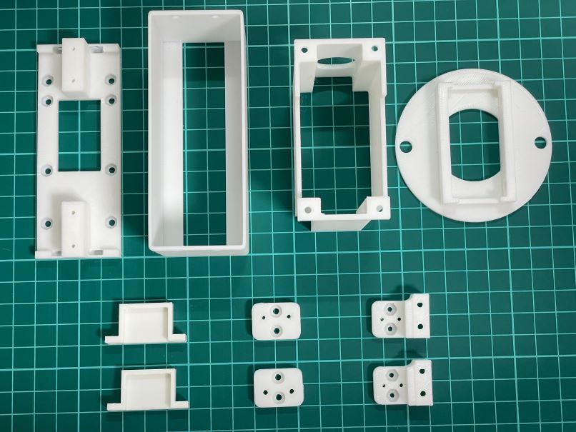
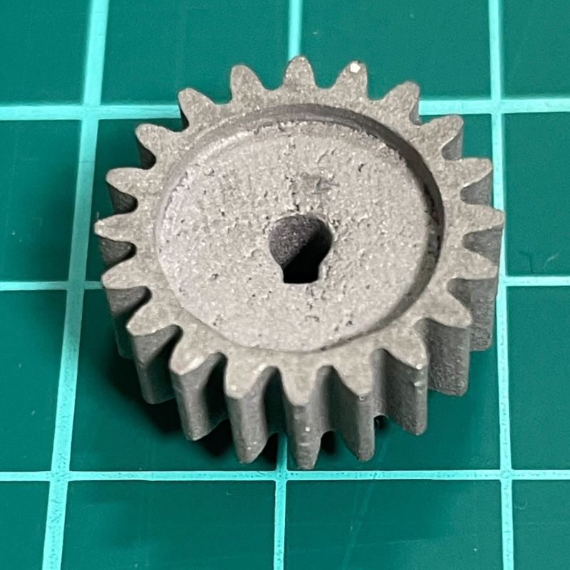
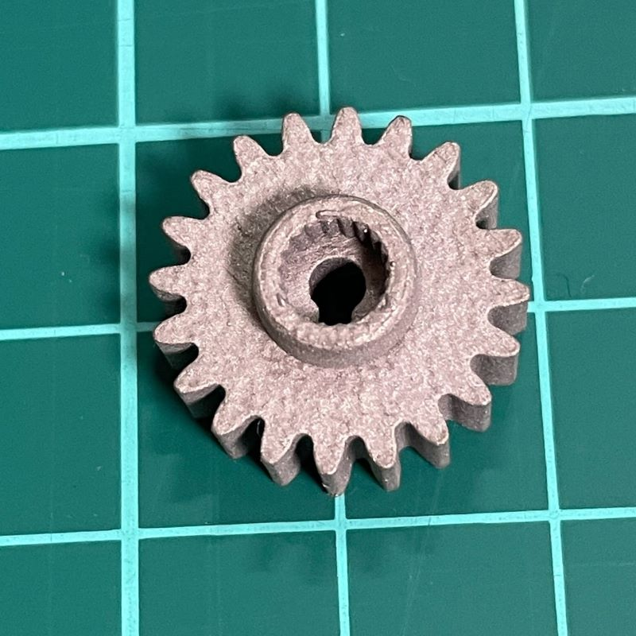

# Electric Parallel Gripper Bill Of Materials(XL330 version)

## 1. 3D print parts 
stl files are available in ./3dprint_parts/stl
  - [Base](./3dprint_parts/stl/XL330_base_for65mm.stl) x1
  - [TipCover](./3dprint_parts/stl/TipCover_for65mm.stl) x1
  - [ToArm](./3dprint_parts/stl/ToArm.stl) x1
  - [R75_cover](./3dprint_parts/stl/R75_cover.stl) x1
  - [XL330_cover](./3dprint_parts/stl/XL330_cover.stl) x1
  - [Rail_base_to_rack](./3dprint_parts/stl/Rail_base_to_rack_dynamixel.stl) x1
  - [Claw_adapter](./3dprint_parts/stl/claw_adapter.stl) x1

Note: To keep the gripper weight small, thickness of these parts are thin.

  - [Gear20Tooth_forXL330](./3dprint_parts/stl/Gear20Tooth_forXL330.stl) x1 (3D printing with metal material strongly reccomended. I used SLM)

## 2. CNC Miling parts
step files and drawings are available in ./cnc_miling_parts/  
Optionally, stl files for 3d printing are also available but these parts need stiffness so I recommend to use Aluminum for these parts.

  - [Claw50mm](./cnc_miling_parts/Claw_50mm.step) x2

## 3. parts from shops
  - XL330-M288-T x1 ()
  - SSE2B6-100 x1 ()
  - RGEAL0.8KA-55-A5-B10-C10-D10 x2 ()
  - M2x4mm bolt x 8
  - M2x6mm bolt x 8
  - M2.3x5mm bolt x4
  - M3x8mm bolt x22
  - M3.5x6mm bolt x4
  - M4x6mm bolt x 4
  - M6x10mm bolt x2
  - M3 nut x12
  - M4 nut x4

## 4. electronic components (Just for reference. You can choose your own micro controller and other components to control the servo motor)
  - OpenRB-150(https://emanual.robotis.com/docs/en/parts/controller/openrb-150/)
  - RS485 to TTL Converter Unit (https://shop.m5stack.com/products/rs485-module)
  -  Lite 6 end adapter cable (Ask UFactory to purchase)
  - Wires