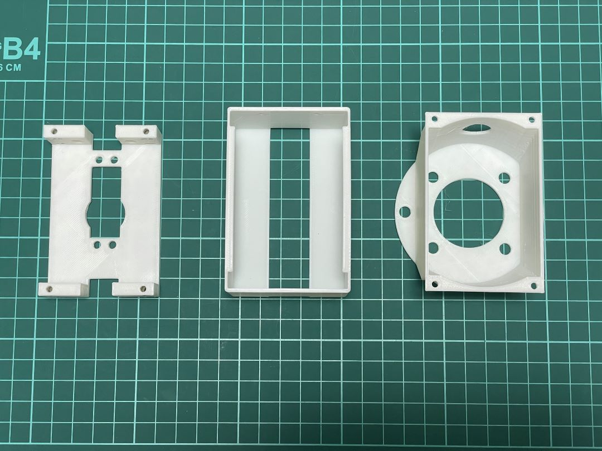
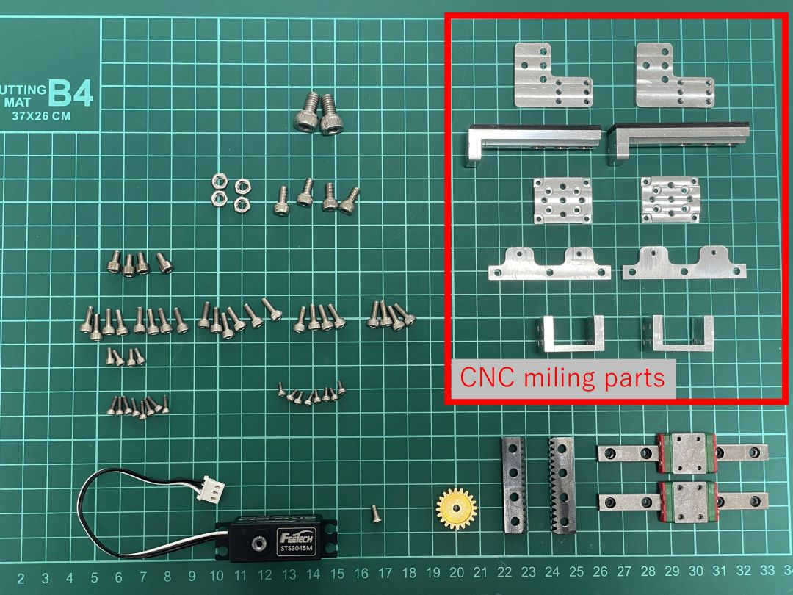

# Electric Parallel Gripper Bill Of Materials

## 1. 3D print parts 
stl files are available in ./3dprint_parts/stl
  - [Base](./3dprint_parts/stl/SCS3045MBase.stl) x1
  - [TipCover](./3dprint_parts/stl/TipCover.stl) x1
  - [ToArm](./3dprint_parts/stl/ToArm.stl) x1

Note: To keep the gripper weight small, thickness of these parts are thin.

## 2. CNC Miling parts
step files and drawings are available in ./cnc_miling_parts/  
Optionally, stl files for 3d printing are also available but these parts need stiffness so I recommend to use Aluminum for these parts.
  - [claw_base](./cnc_miling_parts/claw_base.step) ([drawing](./cnc_miling_parts/drawing/claw_base.pdf)) x2
  - [claw50mm](./cnc_miling_parts/claw50mm.step) ([drawing](./cnc_miling_parts/drawing/claw50mm.pdf)) x2
  - [rail_base_holder](./cnc_miling_parts/rail_base_holder.step) ([drawing](./cnc_miling_parts/drawing/rail_base_holder.pdf)) x2
  - [rail_fixer](./cnc_miling_parts/rail_fixer.step) ([drawing](./cnc_miling_parts/drawing/rail_fixer_edit.pdf)) x2
  - [rack_to_rail_base](./cnc_miling_parts/rack_to_rail_base.step) ([drawing](./cnc_miling_parts/drawing/rack_to_rail_base.pdf)) x2

## 3. parts from shops
  - SCS3045M x1 (https://www.aliexpress.com/item/1005002219505397.html)
  - gear_20tooth x1 (https://www.servocity.com/32p-20-tooth-25t-3f-spline-servo-mount-gears/)
  - SSEB8-70 x2 (https://jp.misumi-ec.com/vona2/detail/110302586530/?HissuCode=SSEB8-70&PNSearch=SSEB8-70&KWSearch=SSEB8-70&searchFlow=results2products)
  (This may fits too https://www.amazon.com/dp/B01L88R8SY)
  - RGEAL0.8KA-40-A5-B10-C10-D10 x2 (https://jp.misumi-ec.com/vona2/detail/110300429920/?ProductCode=RGEAL0.8KA-40-A5-B10-C10-D10)
  - M2x4mm bolt x 8
  - M2x6mm bolt x 8
  - M2.3x5mm bolt x4
  - M3x8mm bolt x22
  - M3.5x6mm bolt x4
  - M4x6mm bolt x 4
  - M6x10mm bolt x2
  - M3 nut x12
  - M4 nut x4

## 4. electronic components (Just for reference. You can choose your own micro controller and other components to control the servo motor)
  - FE-URT1-C001 (https://www.aliexpress.com/item/1005001803208568.html)
  - ATOM Lite(https://shop.m5stack.com/products/atom-lite-esp32-development-kit)
  - RS485 to TTL Converter Unit (https://shop.m5stack.com/products/rs485-module)
  - ATOM Mate Adapter DIY Expansion Kit (https://shop.m5stack.com/products/atom-mate)
  -  Lite 6 end adapter cable (Ask UFactory to purchase)
  - Wires